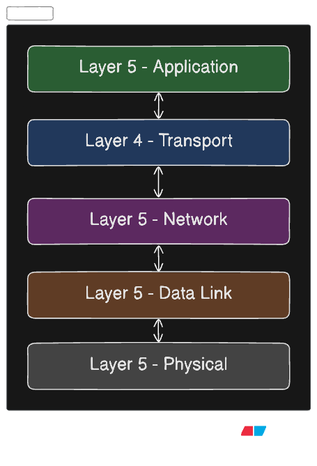

# TCP/IP Stack in C — from scratch

A fully layered TCP/IP stack built in C for learning purposes. Every layer is isolated in its own file, heavily commented in plain English, and wired together so you can trace a packet from raw bytes all the way up to an HTTP response.

---

## Layers




I have used 5 layers coz, for learning purpose it would be simple for me. Last 2 layers can be combined like (RFC 1122 ~ 4 layered official TCP/IP model)

## File structure

```
tcpip_stack/
├── include/
│   └── tcpip.h               # All structs, constants, declarations
└── src/
    ├── utils.c               # Checksum, byte-order helpers
    ├── stack.c               # Stack init + packet injector
    ├── layer1_physical.c     # PHY: raw bytes in/out
    ├── layer2_ethernet.c     # Ethernet + ARP
    ├── layer3_ip.c           # IPv4 + ICMP
    ├── layer4_udp.c          # UDP
    ├── layer4_tcp.c          # TCP full state machine
    ├── layer5_application.c  # HTTP echo server
    └── main.c                # 5 live demos
```

---

## Build & run

```bash
git clone https://github.com/your-username/tcpip-stack.git
cd tcpip-stack
make
./tcpip
```

Requires: `gcc`, `make`, any Linux or macOS machine.

---

## What the demo shows

Running `./tcpip` walks through five scenarios — no real network needed, everything is simulated in memory:

1. **ARP request** — stack asks "who has 10.0.0.1?" via broadcast
2. **ARP reply** — remote host responds, MAC is cached
3. **ICMP ping** — echo request received, echo reply sent
4. **UDP echo** — datagram arrives on port 7, bounced back
5. **TCP + HTTP** — full 3-way handshake, HTTP GET received, 200 response sent, FIN teardown

---

## What you'll learn

- How Ethernet frames are built byte by byte
- What ARP is and why it exists
- How IPv4 headers work (TTL, checksum, protocol field)
- The TCP state machine.
- Why TCP needs a pseudo-header for its checksum
- How port numbers let one machine run many services at once

---

## Learning order

Read the files in this order — each one only depends on what came before it:

| Step | File | Concept |
|------|------|---------|
| 1 | `utils.c` | Checksum, byte order |
| 2 | `layer1_physical.c` | NIC abstraction |
| 3 | `layer2_ethernet.c` | Frames, MAC, ARP |
| 4 | `layer3_ip.c` | IPv4, ICMP |
| 5a | `layer4_udp.c` | Ports, datagrams |
| 5b | `layer4_tcp.c` | State machine, handshake |
| 6 | `layer5_application.c` | HTTP response |
| 7 | `stack.c` + `main.c` | Integration |

---

## License

MIT — use it, break it, learn from it.